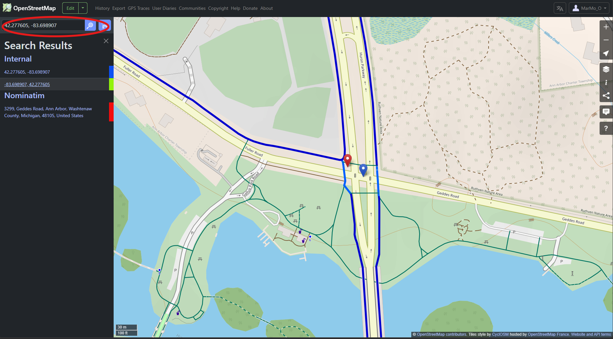
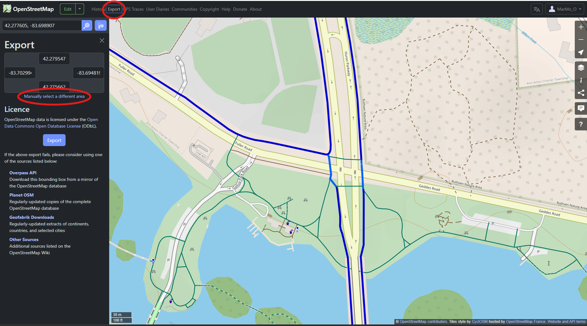
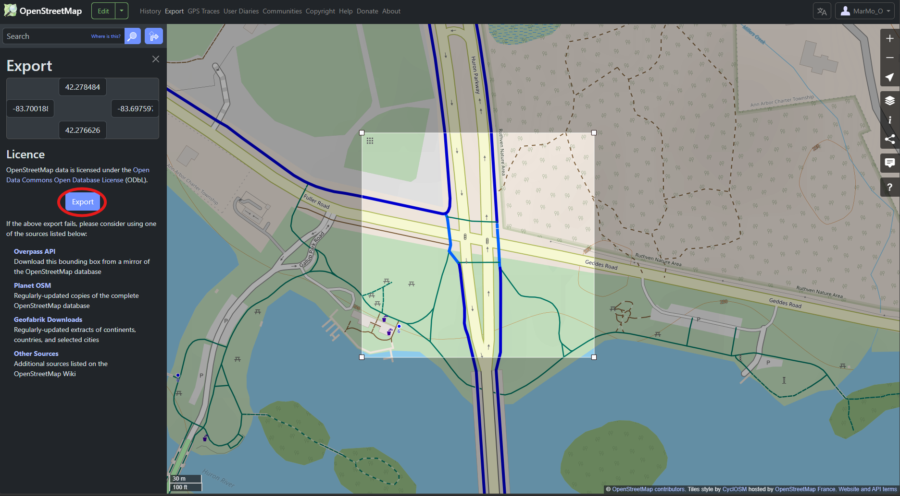

# Download OSM Map

In this step, you will download the raw OSM map data for your target intersection.

## Procedure

1. Sign in to [OpenStreetMap](https://www.openstreetmap.org/).

2. Search for the target location to find the desired intersection.

3. Export the raw OSM map

Click `Export` at the top, then click `Manually select a different area`.

Adjust the bounding box so that the intersection is centered within it. The width and height of the bounding box should be around 100 m. Then click `Export` to download the raw OSM map.

The downloaded file will be named `map.osm`.
