# Edit Topology

This step focuses on the topological structure of the map. You will correct lane counts, fix connections between lanelets, and verify that all adjacency and sequencing relationships (left, right, predecessor, successor) are properly defined.

**This step can only be performed on a Linux system!**

## Procedure

1. Convert the map format

Use the following command to convert the OSM map to a CommonRoad map, and replace `example/src/map.osm` and `example/src/map_cr.xml` with the real path of your osm map file and commonroad map file:
```
python osm2commonroad.py --osm-file example/src/map.osm --cr-file example/src/map_cr.xml
```

2. Open CommonRoad Scenario Designer

```
conda activate map
crdesigner
```

Open the CommonRoad map `map_cr.xml`.

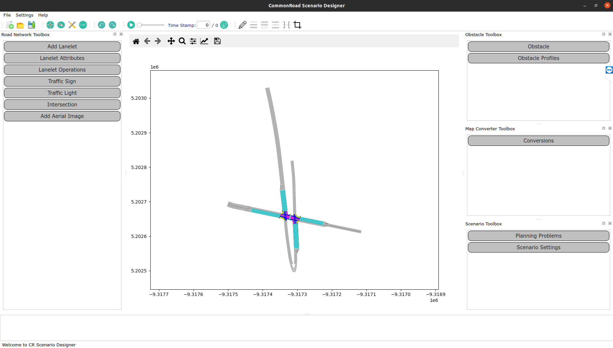

3. If you find that one of the branches is missing, please open the origianl OSM map file `map.osm` using [JOSM](https://josm.openstreetmap.de/). Then click the missing branch, set the "Highway" key to "secondary". Add or set "lanes" to correct number. Add or set "lanes:forward" to the number of the lanes that is heading to the same direction as the arrow of the missing branch. Add or set "lanes:backward" to the number of the lanes heading to the opposite direction. Then following step 1 to convert it to commonroad map again.

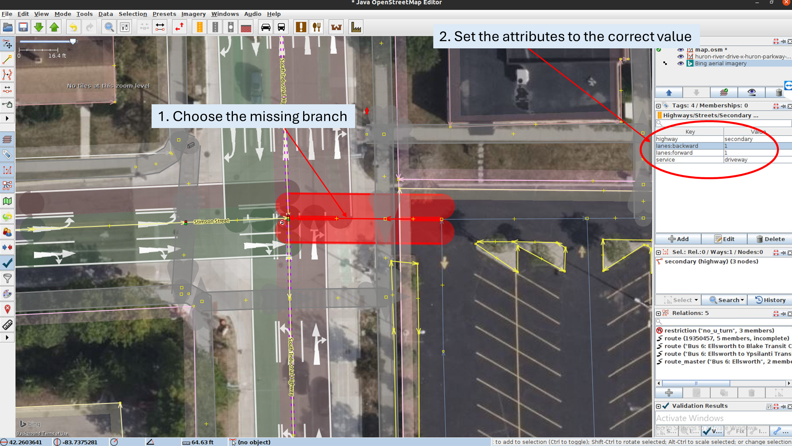

4. Check the lane count

Cross-reference with the satellite view of Google Maps. If there are extra lanes, select each one and press `Del` to delete it.

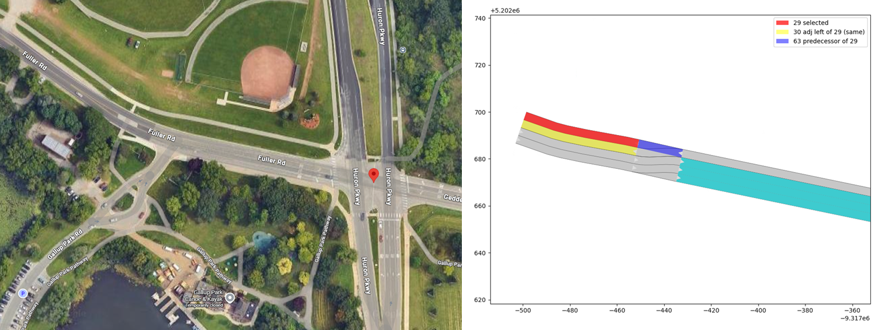

If a lane is missing, select its adjacent lanelet and click  (`add adjacent left`) or  (`add adjacent right`) to add a new lane.

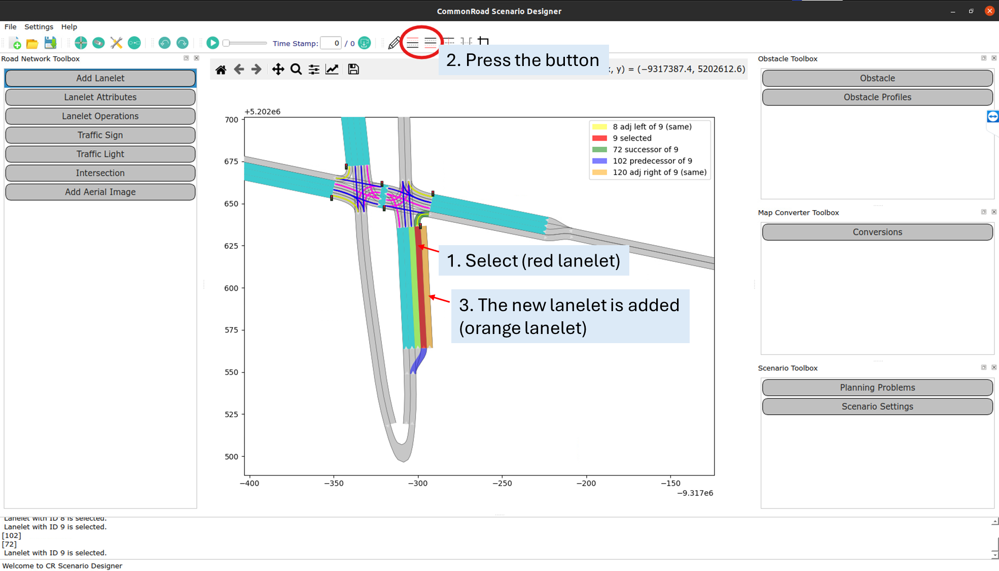

5. Check connections

Cross-reference with the satellite view of Google Maps and delete any incorrect connections. Note that there may also be incorrect connections outside the intersection.

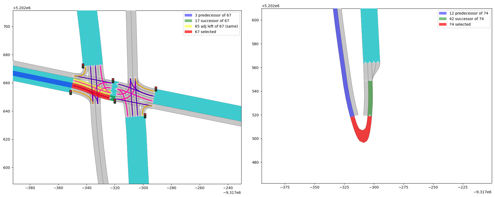

To add correct connections, open `Lanelet Operations`. Click the successor (the green lanelet), then click the predecessor (the dark blue lanelet), and finally click `Connect [1] and [2]` to create the connection. Note that you may need to add connections outside the intersection as well, especially where the lane count changes.

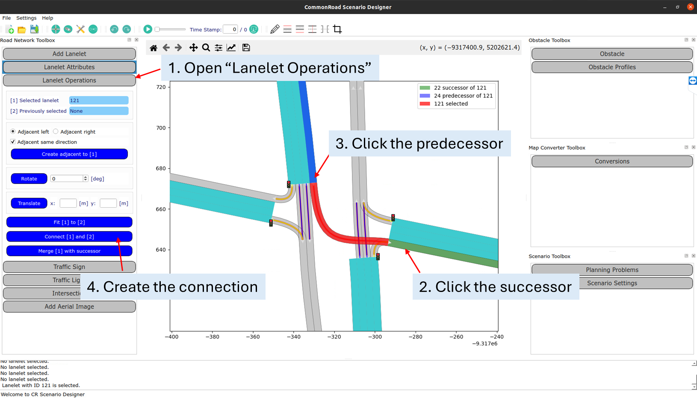

6. Check the neighboring lanelets

Click each lanelet to verify that all its neighboring lanelets are correctly configured. You can do this by observing the highlighted lanelets or reading the legend. If any are incorrect, go to `Lanelet Attributes` → `Lanelet Attributes` → `Neighboring Lanelets`, select the correct lanelet ID, and click `Update`.

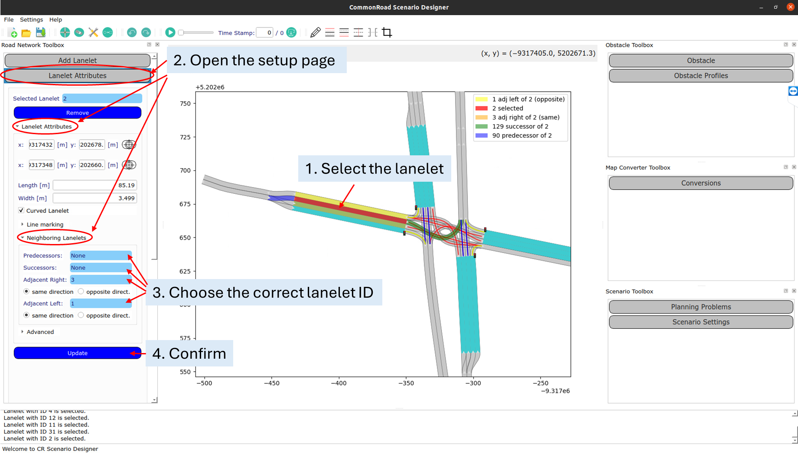

7. Add crosswalks

Open "Add Lanelet", choose "Place at position", then choose "select end pos".

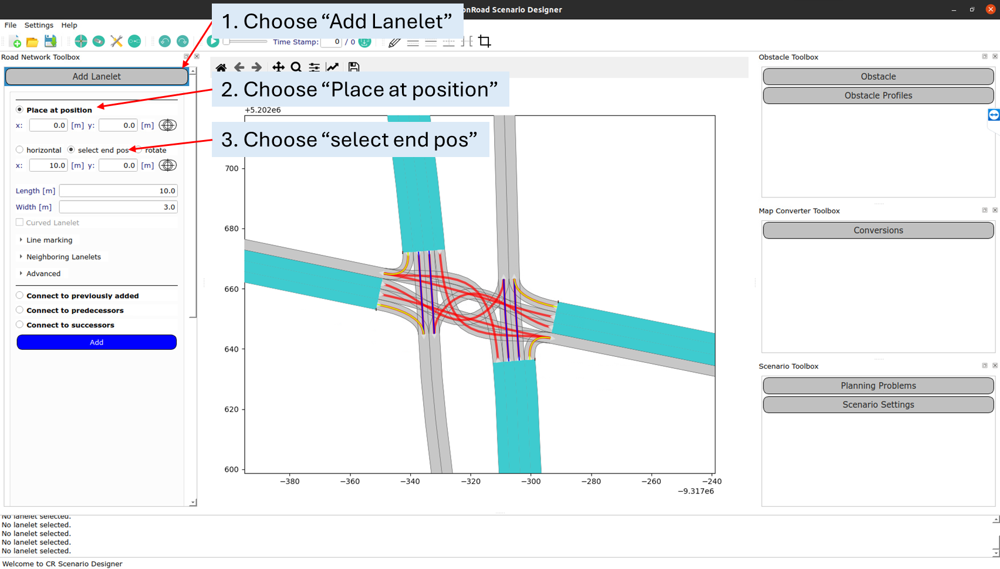

Click 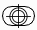 on the top and click on the map to select the start point of the crosswalk, then click the other  to select the end point. Click `Add` to create the crosswalk.

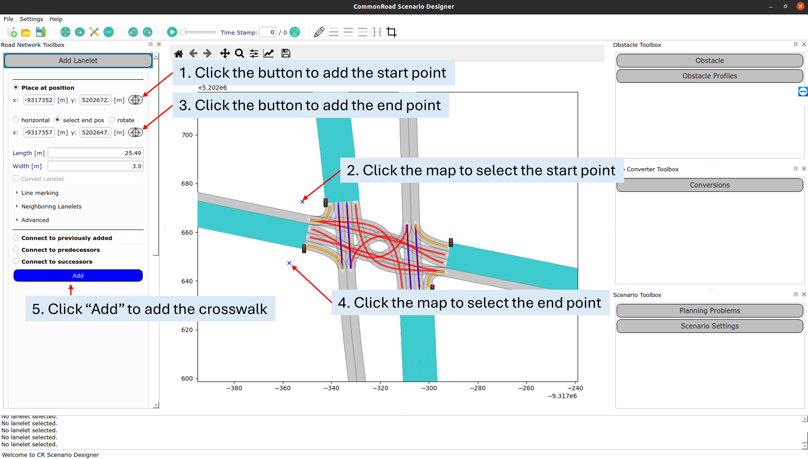

8. Save the map

Press `Ctrl + S` to save. Upon completion, the output should look like this:

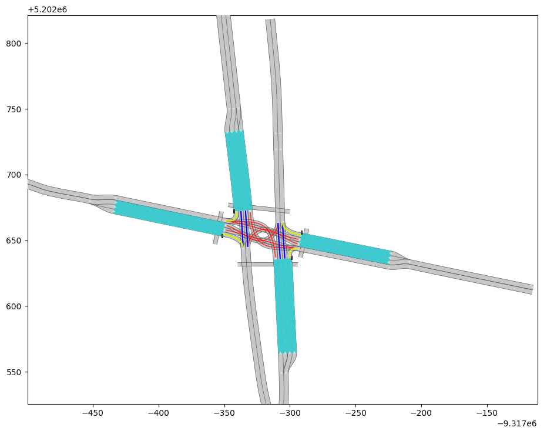

## Precautions

1. Sometimes, when you zoom in and perform operations, lanelets outside the visible area may be deleted. To avoid this, select the target lanelets, zoom out until most lanelets are visible on screen, and then perform the operation.

2. If the lane positions look incorrect or connections appear misshapen, don't worry — these will be addressed in the next step.

3. Be careful when checking connections, as some errors are easy to overlook. In the left figure, the dark blue lanelet should only connect to the two right lanelets above it (highlighted in light blue), while the lanelet immediately to its left should connect to the two left lanelets — the red connection is therefore wrong. On the right, the red lanelet is a left-turn lane, but following it leads to a U-turn instead, making it also incorrect.

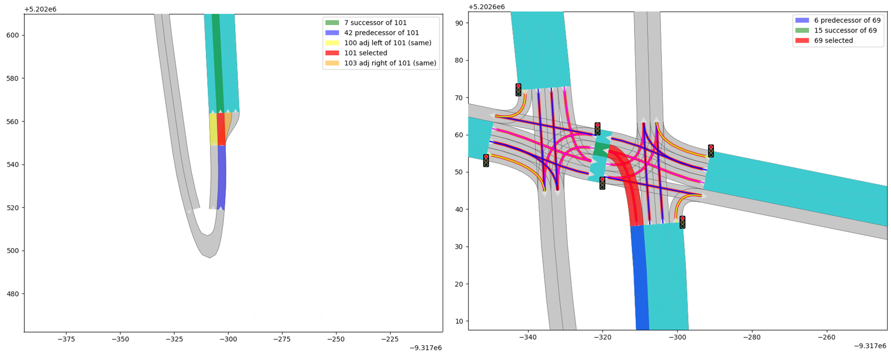

4. Make sure the adjacent lanelets share the same boundary. Sometimes, connections for through lanes are incorrect. If you use step 4 to add a connection, you may find that adjacent connections do not share the same boundary, as shown in the figure below. In this case, it is better to use the method in step 3 to add an adjacent left/right lanelet instead.

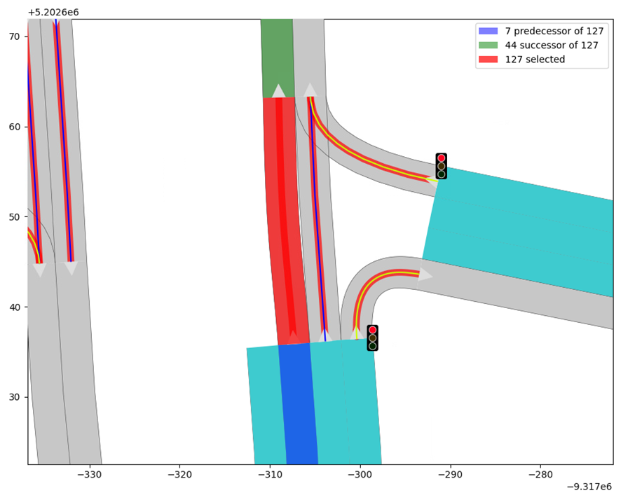
