# Fine-Tune Geometry

This step focuses on geometric accuracy. You will adjust lane boundary positions, add traffic lights, and align all map elements with the satellite imagery to ensure they reflect real-world conditions.

## Procedure

1. Convert the CommonRoad map to a Lanelet2 map using the following command. Note that the Lanelet2 output folder name must match the name used in the config file (e.g., `"fuller_huronPkwy"`). Please replace `example/src/USA_FullerRdHuronPkwy-94_1_T-1.xml` and `example/fuller_huronPkwy/lanelet2.osm` with the real path of your commonroad map file and lanelet2 map file.

```
python commonroad2lanelet.py --cr-file example/src/USA_FullerRdHuronPkwy-94_1_T-1.xml --lanelet2-file example/fuller_huronPkwy/lanelet2.osm
```

2. Download [JOSM](https://josm.openstreetmap.de/). Java is required to run this software. If you have trouble with the official installer, you can also install it via the official JOSM APT repository — refer to an LLM or online resources for guidance.

Open the converted file in JOSM.

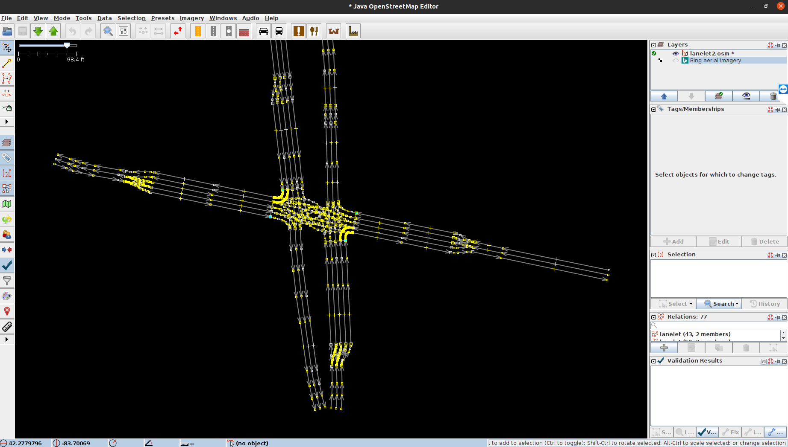

3. Open the background satellite map

Click `Imagery` → `Bing aerial imagery` to enable the satellite map. If it doesn't work, try the other available options.

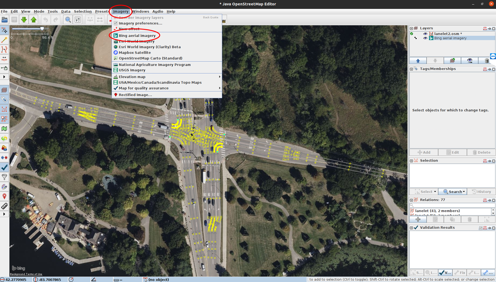

4. Delete the extra nodes (optional)

You can use the script `prune_lanelet2_geometry_nodes.py` to automatically delete nodes that are too close to each other.
`--min-distance` specifies the minimum distance (in meter) between nodes.

```python prune_lanelet2_geometry_nodes.py lanelet2.osm -o lanelet2_pruned.osm --min-distance 2```

You can manually delete some nodes as well. Here is the guide for manual node deletion in JOSM:
There are often too many nodes (yellow squares) to clearly distinguish the lane boundaries (grey lines) and lanelets (each consisting of several lane boundaries). If the nodes are not in the correct locations and too many would need to be moved, it is recommended to delete the excess nodes first. Click and drag to select multiple nodes, then delete them. If the warning shown below appears, cancel the operation — it indicates that lane boundaries or lanelets may be inadvertently deleted.

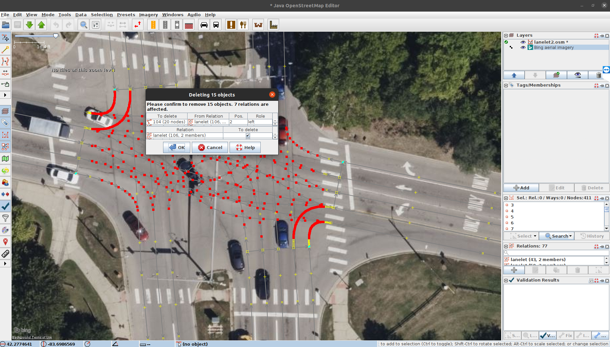

5. Delete incorrect traffic lights and stop lines

Delete the light blue points and the stop lines. If a warning similar to the one in step 4 appears, ignore it.

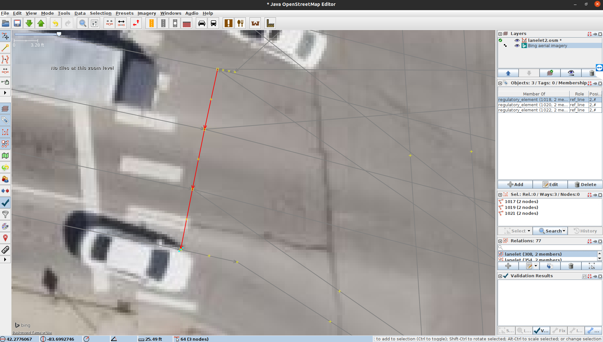

6. Adjust the lane boundaries outside the intersection

Click and drag lane boundaries and nodes to align them with the satellite map. If you need to add more nodes, click and drag the `+` handle on a lane boundary.

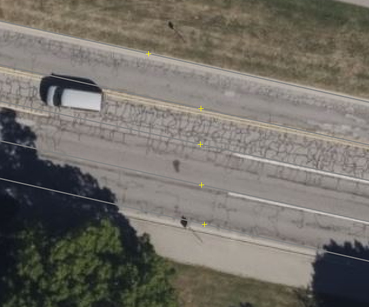

7. Smooth the turning lanelets

Add or remove nodes to make turning lanelets smooth. For right-turn lanelets, align the right boundaries with the road edges. For left-turn lanelets, ensure the shape looks reasonable. To highlight the boundaries of a lanelet, you can click the lanelet in the second window on the right or double click the lanelet in the bottom window on the right.

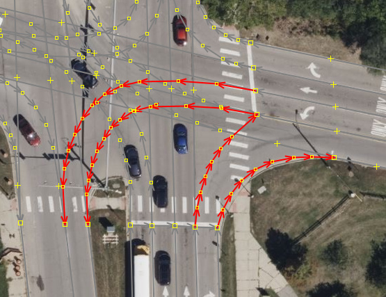

8. Set attributes

Set the "subtype" attribute of all lanelets inside the intersection to "intersection". The intersection means the area bounded by the stop lines. Add the "turn_direction" to the turning lanelets and set it to "left" or "right". Set the "subtype" attribute of all crosswalks to "crosswalk".

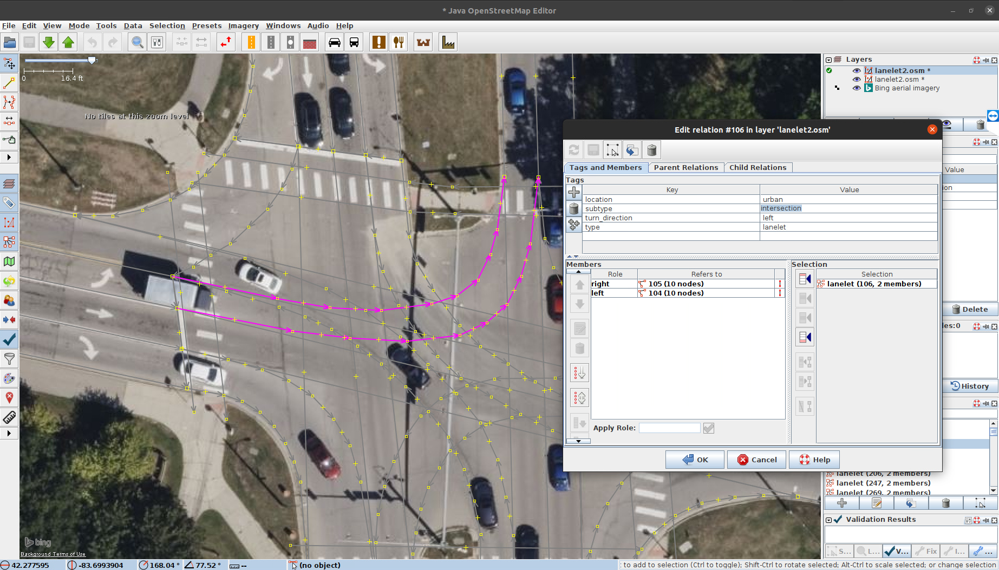

9. Add traffic lights and stop lines

Sometimes, traffic lights are included in the map. But the number and their start and end points are usually incorrect. So you need to delete the original one and create a new one.

You can add them as boundaries by clicking 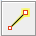 (`Draw nodes`). However, the IDs of newly created elements will all be 0, as shown below.

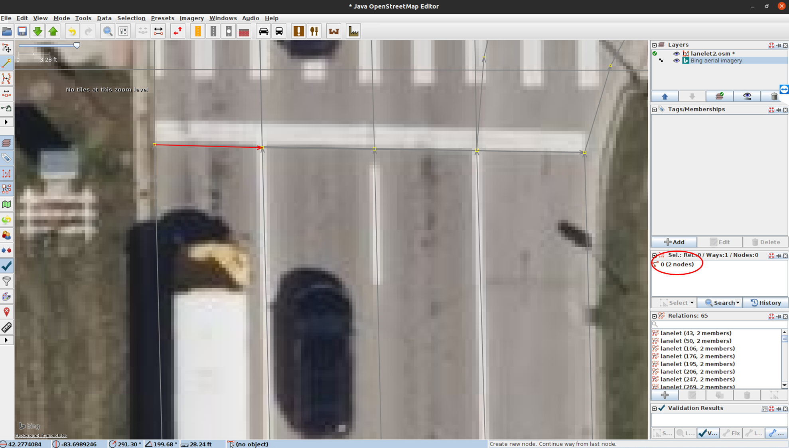

To work around this, add a new boundary directly in the raw OSM file (line 1565 - 1569). The 'id' must be a unique ID, which is different from all existing ID, including nodes, ways (boundaries), and relationships (lanelets). The 'nd' represent the nodes that consist of the boundary. You need to change the value of 'ref' to the correct node ID. The "type" should be set to "traffic_light".
```
<way id='1023' action='modify' visible='true' version='1'>
    <nd ref='20' />
    <nd ref='53' />
    <tag k='type' v='traffic_light' />
  </way>
```

The traffic lights should consist of the end nodes of the lanelets approaching the intersection. When defining the way nodes, always order them from left to right. The way should align with the bottom edge of the stop line as seen in the satellite map, as shown in the following figure. The number of traffic light ways should match the number of distinct traffic signals at the intersection. For example, if there is a left-turn signal and a through signal, use three nodes to define two separate ways: the left and middle nodes cover the left-turn lane, and the middle and right nodes cover the remaining lanes:

```
  <way id='1029' action='modify' visible='true' version='1'>
    <nd ref='1' />
    <nd ref='21' />
    <tag k='type' v='traffic_light' />
  </way>
  <way id='1031' action='modify' visible='true' version='1'>
    <nd ref='21' />
    <nd ref='131' />
    <tag k='type' v='traffic_light' />
  </way>
```

The expected traffic lights look like this:

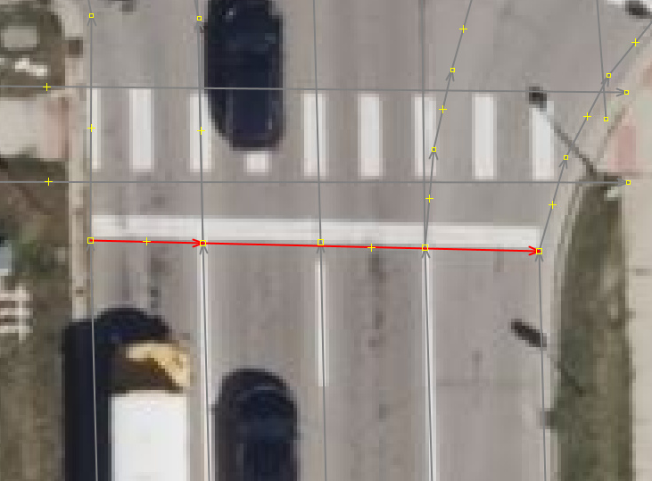

The stop line spans from the leftmost node to the rightmost node. Set its `type` tag to `"stop_line"`:

```
  <way id='1033' action='modify' visible='true' version='1'>
    <nd ref='1' />
    <nd ref='131' />
    <tag k='type' v='stop_line' />
  </way>
```

The expected stop line looks like this:

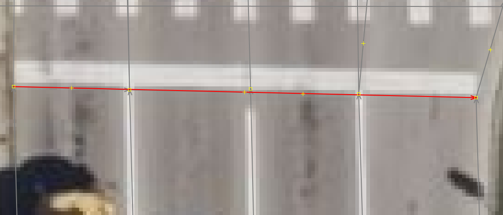

10. Add traffic rules

Run `python create_traffic_rules.py --input example/fuller_huronPkwy/lanelet2.osm --output example/fuller_huronPkwy/lanelet2_with_traffic_rules.osm` to automatically add traffic rules based on the traffic light and stop line you just created. 

After running the script, please use JOSM to open the output file and check if the traffic rules are correctly added. 

The traffic rules should be added as regulatory elements in the lanelet relations. If you find any missing or incorrect traffic rules, you can add or modify them manually in JOSM:
First, add a regulatory element for each traffic light and its corresponding stop line:

```
  <relation id='1030' action='modify' visible='true' version='1'>
    <member type="way" ref="1033" role="ref_line"/>   <!-- stop line -->
    <member type="way" ref="1029" role="refers"/>      <!-- the traffic light -->
    <tag k='subtype' v='traffic_light' />
    <tag k='type' v='regulatory_element' />
  </relation>
```

Next, add the regulatory element to the lanes approaching the intersection that are connected to stop lines and governed by the corresponding traffic light. Add the following code (shown for the fourth lane) to each corresponding lanelet:

```
  <relation id='127' action='modify' visible='true' version='1'>
    <member type='way' ref='126' role='right' />
    <member type='way' ref='120' role='left' />
    <member type='relation' ref='1030' role='regulatory_element' />  <!-- add the corresponding regulatory element to lanelet here -->
    <tag k='location' v='urban' />
    <tag k='subtype' v='road' />
    <tag k='type' v='lanelet' />
  </relation>
```

11. After completing editing, check the lanelet list at the bottom right corner. If there are some lanelets consisting of 0 or 1 member, delete them.


## Precautions

1. Sometimes, a single node is split into two overlapping nodes at the same location that are not connected, as shown below (one node has been moved slightly for clarity). To fix this, hold "Ctrl" and click these two nodes. Then press "m" to merge them.

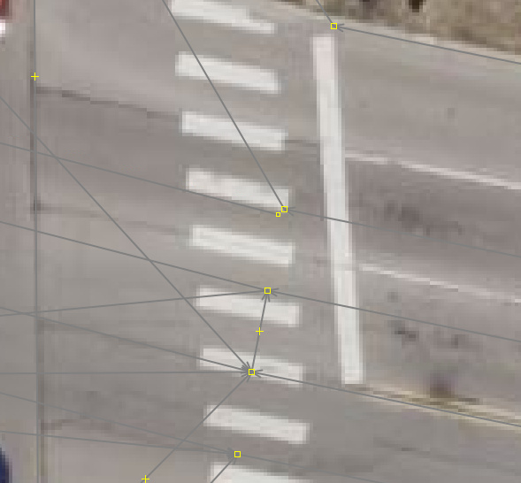

2. The left and right boundaries of each lanelet should be kept at equal length where possible.

3. If you are not sure about the traffic light settings, you can check it using the street view of Google Maps.

4. Never check "Upload" when saving the file.

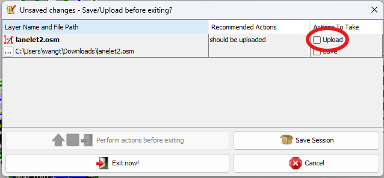


5. Each lanelet associated with the traffic light should be long enough to span the length of several vehicles.

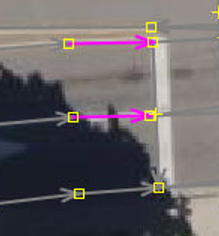
