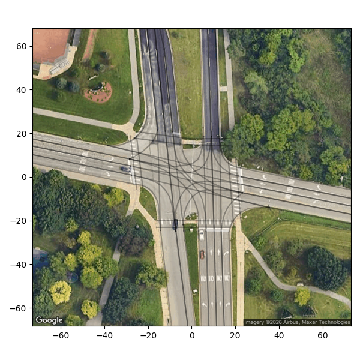
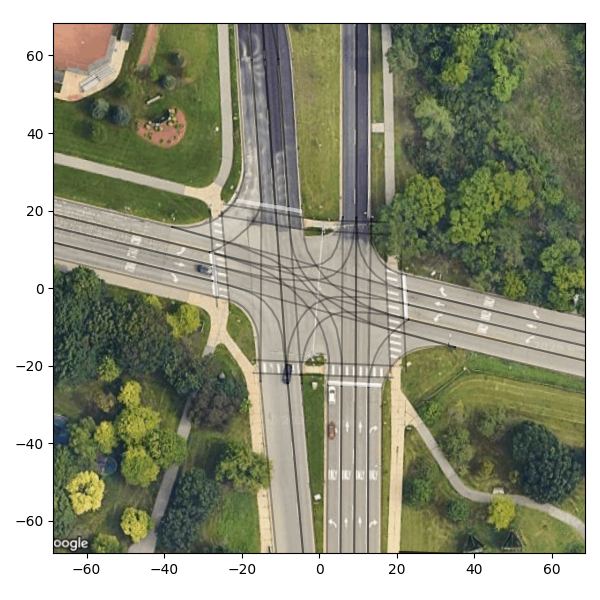

# Verify Output

In this step, you will convert the map to local coordinates and visualize it to verify that all lanes, connections, and traffic elements are correctly defined and positioned.

## Procedure

1. Prepare the config file (optional)

Create the config file at `example/fuller_huronPkwy/configs.json` with the following content:

```
{
    "id": "94_FUL_GED_HP",
    "name": "Fuller Rd & Huron Pkwy",
    "origin": {
        "lat": 42.277605,
        "lon": -83.698907,
        "rotation": 0,
        "x_offset": 0,
        "y_offset": 0
    }
}
```

2. Obtain a [Google Maps API key](https://developers.google.com/maps/documentation/maps-static/get-api-key) (optional)

3. Visualize the map

Run the following command to visualize the map in local coordinates (--google-maps-api-key is optional):
```
python plot_map.py --map-path example/fuller_huronPkwy --google-maps-api-key ${google_maps_api_key} --output-file example/fuller_huronPkwy.png
```


Since coordinate conversion may introduce small offsets, you may need to manually adjust "rotation", "x_offset", and "y_offset" in `configs.json` to align the lane boundaries with the Google Maps imagery. Note that the unit of rotation is degrees.

```
    "origin": {
        "lat": 42.277605,
        "lon": -83.698907,
        "rotation": 2,
        "x_offset": 0,
        "y_offset": 0
    }
```



As shown above, the crosswalks on the west and south sides are not in the correct position. In this case, manually adjust the crosswalk positions in JOSM to align them with the local coordinate system.

The complete map should look like this:


